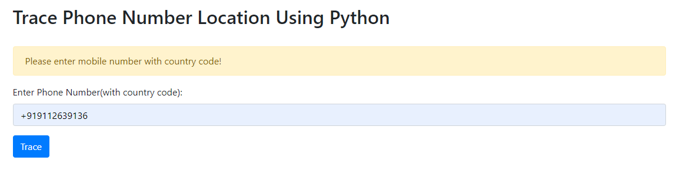
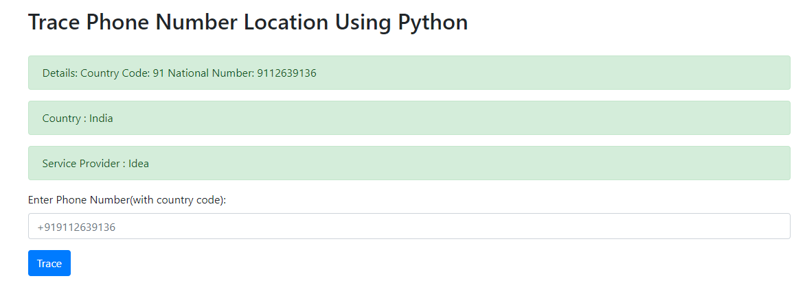

# Devloper Note

# How to setup this project on your machine?

INSTALL required libraries
- pip install phonenumbers
- pip install falsk
- pip install requests

# Project root:- 

Mobile_Tracking (project root)

       - templates (package)

         - trace.html ()

       - app.py (program file )

       - main.py (2nd root of project)

# URLS used in project:-

1) Output:- 

http://127.0.0.1:5000/trace

2) Output:- 
http://127.0.0.1:5000/trace

